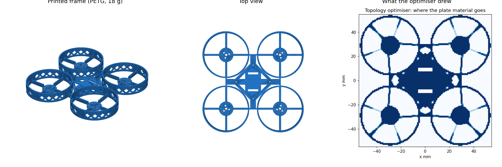

# PETGasus

A small 3D-printed quadcopter for an adult and a kid to build together. It needs no soldering, prints in one piece in PETG, and flies by sight (no camera or goggles), mostly indoors.

**[See the design explained, with a 3D build-along →](https://neuman.github.io/PETGasusDrone/)**



| | |
|---|---|
| Frame | 108 × 108 × 15 mm, one PETG print, ~18 g, no supports |
| Ready to fly | ~45 g, under the FAA's 250 g registration line |
| Props | 45 mm, each spinning inside its own duct |
| Flight time | ~3.9 min per 1S 320 mAh battery (estimate) |
| Electronics | Taken from a BetaFPV Meteor75 Pro kit: plug-in motors, no soldering |
| Control | ExpressLRS radio, Betaflight flight software, self-levelling mode |
| Cost | $167 for everything, including radio, batteries and charger; $148 for the essentials |

## Build one

- **[BUILD_GUIDE.md](BUILD_GUIDE.md)** covers the shopping list, the two measurements to take before printing, print settings, assembly, radio binding, Betaflight setup and first flights.
- **Print files:** [`build/print/frame.3mf`](build/print/frame.3mf) for Snapmaker Orca, Bambu Studio or PrusaSlicer, and [`build/print/frame.stl`](build/print/frame.stl) for anything else.

## How the frame was designed

The plate that holds the motors came out of a 2.5D topology optimisation (SIMP: plate bending plus in-plane stiffness, a hover load and a crash load). The optimiser's raw field had 0.75 mm blades, which are too thin to print. So its load path was redrawn as printable ribbed spokes, and that exact printed shape was checked again with the same finite-element model.

| | Ordinary X frame | PETGasus |
|---|---|---|
| First vibration mode | 171 Hz | 282 Hz |
| Crash stiffness | 1× | ~3.5× |

The higher first mode keeps the frame away from the wobble that printed frames are known for. The reasoning, including what was tried and rejected, is in [`decisions/`](decisions/) and [`docs/decisions.md`](docs/decisions.md).

## What is proven and what isn't

Every number above comes from the model, [`model/petgasus.py`](model/petgasus.py). Each requirement is a file in [`claims/`](claims/) and has an automated check that must be able to fail. Current state:

- **Pass (simulation and geometry):** lift, weight, flight time, vibration mode, parts fit with no clashes, screws, motor wire length, printable with no supports, one piece.
- **Fail:** the $150 budget (C10). The full list is $167; it fits under $150 by skipping the optional spare props, screws and strap.
- **Assumed, not yet measured (A1–A6):** for example, how much the ducts cost in thrust, and the kit board's size.
- **Not tested on a real drone yet (P1–P5):** crash drops, hover, Betaflight setup, fit and thrust. Each test is described in its claim file and in the build guide.

## Working on the design

The checks run with [nopekit](https://github.com/neuman/nopekit).

```sh
pip install -r requirements.txt
pip install git+https://github.com/neuman/nopekit

python3 -m nopekit check --tier 1     # rebuild the model and run every check
python3 -m nopekit site build         # regenerate the project site
python3 -m nopekit site serve         # plain-language front page at site/index.html
python3 tools/run_topopt.py           # re-run the topology optimiser (~6 min)
```

Change a number in `model/petgasus.py`, then run `check`. After any model change, refresh the known-good reference with `python3 tools/freeze_known_good.py` before running `check`.

| Path | What it is |
|---|---|
| `model/` | The single source of truth: parameters, geometry (manifold3d), topology optimisation, assembly |
| `gates/` | The project's own checks; each reads its limit from a claim |
| `claims/` | What must be true, with acceptance limits and reasons |
| `selftest/` | Known-good design and known-bad fixtures every check must catch |
| `bom/` | Parts, prices and sources |
| `views/`, `site/` | The project site (`site/index.html` is the plain-language front page). Pushing `site/` to `main` publishes it to GitHub Pages |
| `.nopekit/verdicts/` | Check results, kept as evidence |
